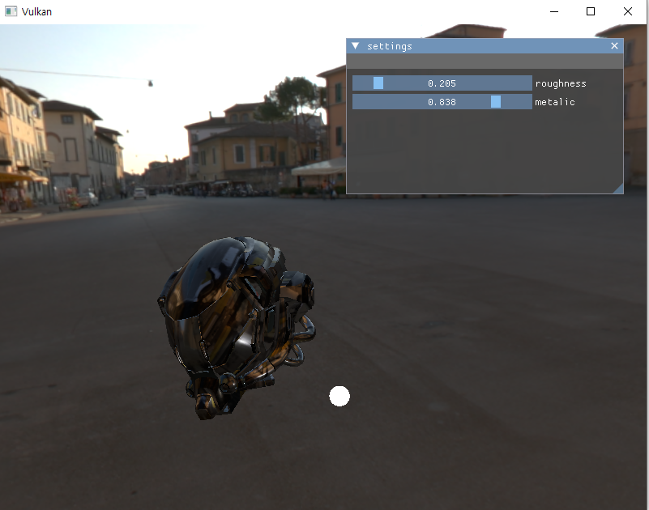

# VulkanRenderer
- vulkan api를 사용한 미니 렌더러입니다.

# 세팅
- BuildProject1.bat를 실행해주세요.

# Feature

- Instancing
- PBR-IBL
- Mouse-Picking
- Deferred-rendering (using subpass)
- Omnidirectional-shadowMapping
- KTX(Khronos Texture) texture storage Format을 사용하였습니다.
- gtlf 2.0 format with tinygltf [tinygltf](https://github.com/syoyo/tinygltf).

# InProgress
- GPUT based Culling and LOD
- SSAO

# 조작법
- 마우스로 회전 및 wasd키로 이동 및 마우스휠로 줌인 줌아웃.
- 헬멧을 클릭하여 회전을 할 수 있습니다 

