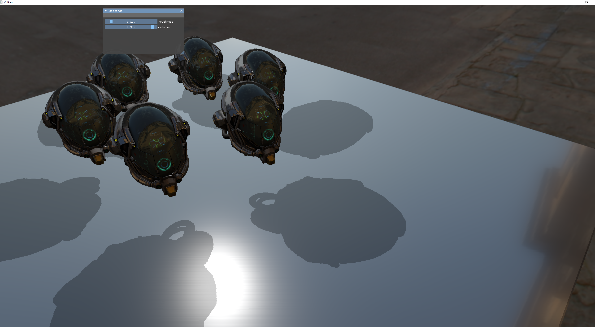

# VulkanRenderer
- vulkan api를 사용한 미니 렌더러입니다.


# Entry Point
- Project1/Main.cpp
```C++
int main()
{
	try {
		// swapchain, framebuffer, color, depth attachment are to fixed with window size
		// every time window resize, you must create new swapcahin and others...
		jhb::JHBApplication app;
		app.Run();
	}
}
```

# Feature

```
- Instancing
- PBR
- HDR Tone Mapping : uncharted tone mapping (https://www.gdcvault.com/play/1012351/Uncharted-2-HDR)
- KTX(Khronos Texture) texture storage Format을 사용하였습니다.

```

# In Progress
- apply gltf 2.0 format with tinygltf

# TODO
- animation

# 조작법
- 마우스로 회전 및 wasd키로 이동 및 마우스휠로 줌인 줌아웃.

# 구조


# 세팅
- vulkanSDK(https://vulkan.lunarg.com/sdk/home#windows)를 다운받아 설치 해주세요.
- 그런 후 Project1/ShaderCompile.bat를 실행하여 쉐이더를 한번 컴파일해 줘야합니다.
- vs2022에서만 빌드 및 실행이 가능합니다.

# 참고 자료들
- https://vulkan-tutorial.com/
- https://github.com/SaschaWillems/Vulkan
  - 인스턴싱과 큐브맵, pbr구현에 참고하였습니다.
- https://www.youtube.com/channel/UC9pXmjxsQHeFH9vgCeRsHcw
  - 기본 베이스 구조를 이 강의를 보며 잡았습니다.
  - descriptor, Buffer관련 헬퍼 클래스를 사용하였습니다.
- https://www.youtube.com/playlist?list=PLmIqTlJ6KsE1Jx5HV4sd2jOe3V1KMHHgn
  - vulkan api의 전반적인 개념에 대해 학습하는데 이용하였습니다.
- https://www.youtube.com/@rinthel
  - pbr, cube map, 인스턴싱 등 opengl advanced 개념을 익히는데 도움이 되었습니다.
- https://learnopengl.com/
  - 위 강의의 보조용으로 활용하였습니다.
- https://frguthmann.github.io/posts/vulkan_imgui/
  - imgui 적용에 도움이 되는 글입니다.
